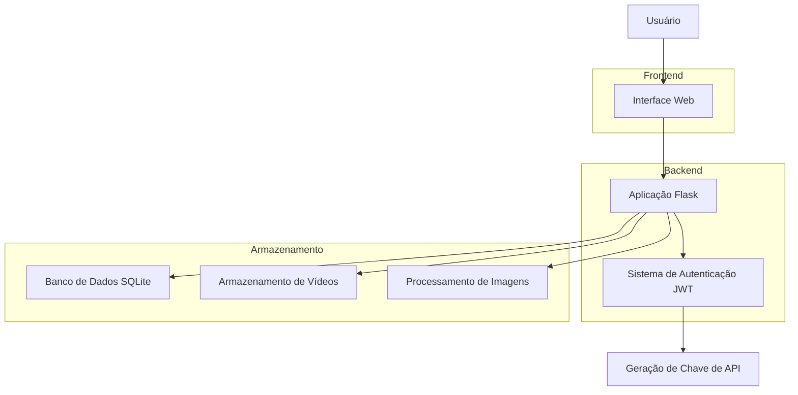

# Arquitetura do Sistema GenVid

## Diagrama de Arquitetura

## Fluxo de Dados

1. **Registro/Login**: O usuário se registra ou faz login através da interface web
2. **Autenticação**: O sistema gera um token JWT para autenticação
3. **Upload de Imagens**: O usuário pode enviar imagens de referência
4. **Geração de Vídeo**: O usuário fornece um prompt e imagens que são processados para gerar o vídeo
5. **Processamento**: A aplicação processa o prompt e as imagens para criar o vídeo
6. **Armazenamento**: Os dados são armazenados no banco de dados SQLite
7. **Resultado**: O vídeo gerado é disponibilizado para o usuário

## Componentes

### Interface Web
- Construída com HTML, CSS e JavaScript
- Utiliza Bootstrap para design responsivo
- Comunica-se com o backend através de chamadas AJAX
- Permite upload de imagens via arrastar e soltar
- Exibe prévias de imagens enviadas
- Mostra vídeos gerados com opção de download

### Aplicação Flask
- Servidor web que lida com todas as requisições
- Implementa autenticação JWT
- Gerencia a comunicação com bibliotecas de processamento
- Controla o acesso ao banco de dados
- Serve arquivos estáticos (imagens e vídeos)

### Banco de Dados
- SQLite para armazenamento local
- Armazena informações de usuários, chaves de API e histórico de vídeos
- Registra referências a imagens de upload

### Sistema de Autenticação
- Utiliza JWT para proteção de rotas
- Gera e valida tokens de acesso
- Gerencia chaves de API para acesso direto à API

### Processamento de Mídia
- MoviePy para geração de vídeos
- Pillow para processamento de imagens
- Gera vídeos animados com base em prompts de texto
- Utiliza imagens de referência para influenciar a geração